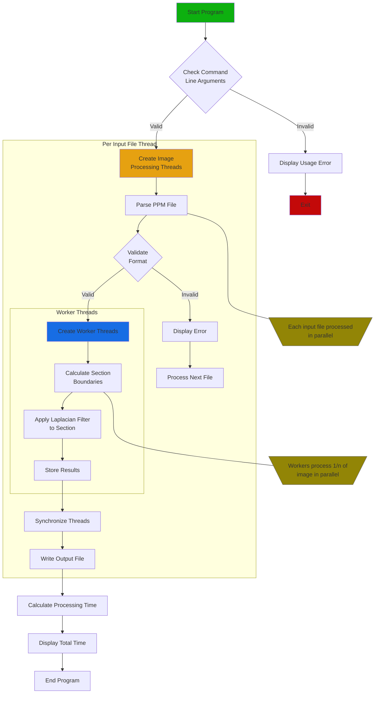

# edge-detector

A multithreaded image processing program that detects edges in PPM
images using a Laplacian filter.


## Overview
[Edge detection](https://www.mygreatlearning.com/blog/introduction-to-edge-detection/)
is an image processing technique used to find discontinuities in
digital images. This program implements the technique using a
Laplacian filter and parallel processing. Written in C, it
processes one or more P6 PPM images concurrently using threads.
For each input image, the program will create a new P6 image as
output that has the edges of the input image.



## Technical Background
### PPM File Format
The P6 PPM (Portable Pixmap) format consists of:

1. Header (in order):

- Image format identifier (P6)
- Optional comments (starting with #)
- Image width and height
- Maximum color value (must be 255)


2. Pixel data:

- Stored in scanline order (left to right, top to bottom)
- Each pixel is 3 bytes (RGB values)

### Laplacian Filter
The program uses convolution to apply this 3x3 Laplacian filter
for edge detection:
```
-1  -1  -1
-1   8  -1
-1  -1  -1
```
